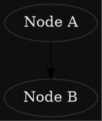
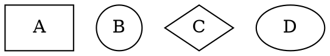

# Diagram Generator Skill

Generate beautiful ASCII and graph diagrams using Graphviz DOT notation, then automatically open them in a GUI viewer.

## Setup

Graphviz must be installed:

```bash
# Linux (Debian/Ubuntu)
sudo apt-get install graphviz

# macOS
brew install graphviz
```

Verify installation:
```bash
dot -V
```

## Usage

### Quick Example

```bash
# Create a simple diagram file
cat > mydiagram.dot << 'EOF'
digraph {
  A -> B;
  B -> C;
  A -> C;
}
EOF

# Generate and open
./scripts/generate-diagram.sh mydiagram.dot
```

### Command Syntax

```bash
./scripts/generate-diagram.sh <dot-file> [format] [viewer]
```

**Arguments:**
- `<dot-file>`: Path to your .dot file (required)
- `[format]`: Output format - png (default), svg, pdf, or "all"
- `[viewer]`: Viewer command - xdg-open (default), eog, feh, display

**Examples:**

```bash
# Render as PNG and open with default viewer
./scripts/generate-diagram.sh architecture.dot

# Render as SVG
./scripts/generate-diagram.sh architecture.dot svg

# Render all formats and open PNG
./scripts/generate-diagram.sh architecture.dot all

# Use specific viewer
./scripts/generate-diagram.sh mydiagram.dot png eog

# Use ImageMagick viewer
./scripts/generate-diagram.sh mydiagram.dot svg display
```

## Output

The script generates output files in the same directory as the .dot file:
- `diagram.png` - Raster image (default)
- `diagram.svg` - Vector graphic
- `diagram.pdf` - PDF document

Example output after running `generate-diagram.sh architecture.dot`:
```
architecture.dot       (input)
architecture.png       (output)
architecture.svg       (output, if requested)
```

## Supported Diagram Types

With Graphviz/DOT you can create:
- **Flowcharts** - Process flows, decision trees
- **Graphs** - Network diagrams, dependency graphs
- **UML-style** - Class diagrams, state machines
- **Architecture** - System components, data flow
- **Trees** - Hierarchies, organizational charts
- **Timelines** - Sequences, Gantt-like representations

## Tips

**Color scheme for dark terminals:**


**Adjust layout direction:**
```dot
digraph {
  rankdir = LR;    # Left to Right (default: TB = Top to Bottom)
  // ... your nodes and edges
}
```

**Control node shapes:**


See [DOT Language Reference](references/dot-reference.md) for full syntax.

## Troubleshooting

**"dot: command not found"**
- Install Graphviz (see Setup section)

**"Diagram rendering failed"**
- Check .dot file syntax with: `dot -Tpng myfile.dot`
- Verify all quoted strings are properly escaped
- Check for special characters in node/edge labels

**"Viewer not opening"**
- Try different viewer: `./scripts/generate-diagram.sh file.dot png eog`
- Or open manually: `xdg-open diagram.png`
