# DOT Language Reference

Quick reference for Graphviz DOT syntax.

## Basic Structure

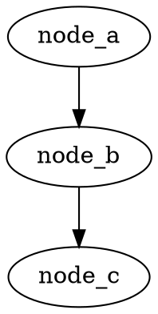

## Nodes

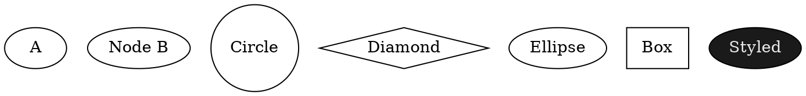

## Edges

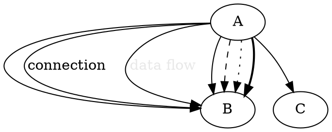

## Graph Properties


## Node Shapes

Common shapes: `box`, `circle`, `diamond`, `ellipse`, `plaintext`, `note`, `folder`, `cylinder`, `record`, `Mrecord`

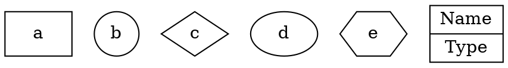

## Colors

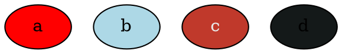

## Styling

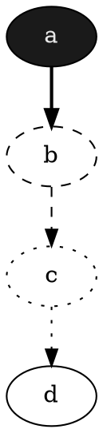

## Subgraphs (Clustering)

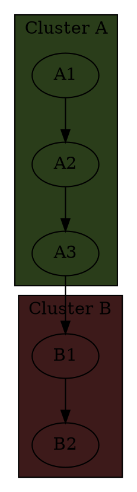

## Comments

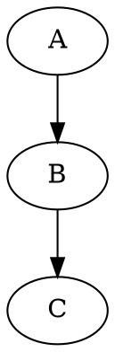

## Dark Mode Example

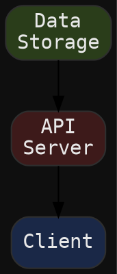

## Practical Examples

### Architecture Diagram

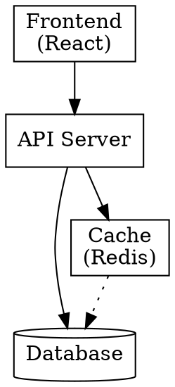

### Flowchart

```dot
digraph Flowchart {
  rankdir = TB;
  
  Start [label="Start", shape=ellipse];
  Decision {label="Choice?", shape=diamond];
  Action1 [label="Action A"];
  Action2 [label="Action B"];
  End [label="End", shape=ellipse];
  
  Start -> Decision;
  Decision -> Action1 [label="Yes"];
  Decision -> Action2 [label="No"];
  Action1 -> End;
  Action2 -> End;
}
```

### State Machine

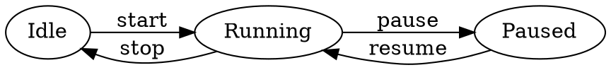

## Resources

- Official: https://graphviz.org/doc/info/lang.html
- Examples: https://graphviz.org/Gallery/
- Colors: https://graphviz.org/doc/info/colors.html
