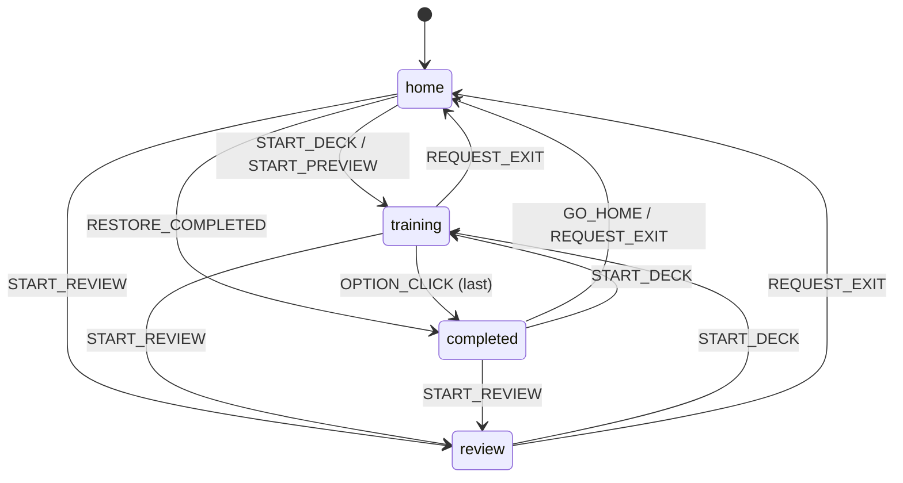
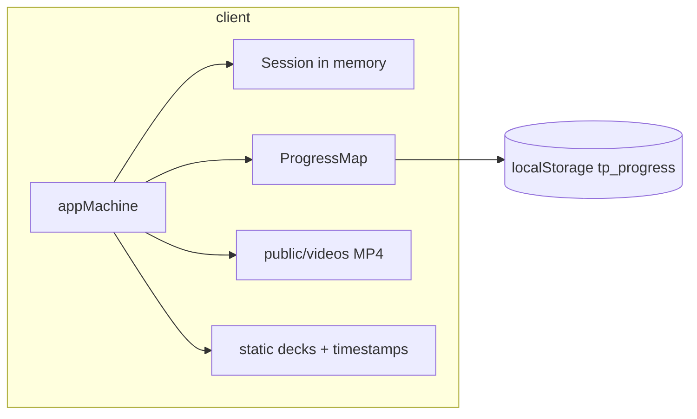

# Architecture

Client-only Vite/React PWA for 10th Planet warmup recall training. No accounts, no progress backend. Train quizzes a deck over local video; Review watches the same video without a quiz.

## Stack

| Layer | Choice |
|--------|--------|
| Build | Vite 8 + React 19 + TypeScript + Tailwind CSS v4 |
| Router | TanStack Router (`src/router.tsx`) |
| State | XState 5 `appMachine` + singleton `appActor` |
| Persistence | `localStorage` key `tp_progress` (and other `tp_*` prefs) |
| Analytics | gtag + `src/utils/analytics.ts` |
| Media | `/videos/{deckId}.mp4` under `public/videos/`, PWA CacheFirst |
| Dev-only | Vite `taggerApiPlugin` writes `moveTimestamps.ts` / notes |

## Entry

```
src/main.tsx
  → RouterProvider(router)
       RootLayout (max-w-[520px] shell, Outlet, footer)
         appActor started from src/appActor.ts
```

There is no `App.tsx`. Live home is `ScheduleHomeScreen` (not unwired `HomeScreen.tsx`).

## State machine

**File:** `src/appMachine.ts`  
**States:** `home` | `training` | `review` | `completed`

| Event | Effect |
|--------|--------|
| `START_DECK` | → `training`; build `session`; `preview: false` |
| `START_PREVIEW` | → `training`; `preview: true`; optional in-memory timestamps |
| `START_REVIEW` | → `review`; `session: null` |
| `OPTION_CLICK` | advance quiz; last move → `completed` via `completeSession` |
| `TAP_OUT` | reset session streak to 0 |
| `REQUEST_EXIT` | → `home` + clear session |
| `GO_HOME` | → `home` without clearing session |
| `RESTORE_COMPLETED` | `home` → `completed` when locked session + `finalAttempt` exist |
| `RESET` / `CANCEL_RESET` | two-step wipe of progress + storage |

### Session vs Progress

- **Session** (`types/domain.ts`): in-memory quiz only (`moveSequence`, streaks, options, timing, `locked`, optional `finalAttempt`). Not persisted as a blob.
- **Progress** (`ProgressMap`): per-deck `bestStreak`, `lastAttemptDate`, `attempts[]`. Loaded at init; written when `context.progress` changes via `appActor` → `saveProgress`.
- Progress updates on last-move `OPTION_CLICK` **unless** `preview === true`.
- Review never creates a session and never writes progress.



## Routes

| Path | View |
|------|------|
| `/` | `ScheduleHomeScreen` (`week`); may redirect to `/series/$letter` |
| `/series/$letter` | `ScheduleHomeScreen` (`week`) |
| `/all` | `ScheduleHomeScreen` (`all`) |
| `/progress` | `ProgressScreen` |
| `/$deckId` | `ProgressScreen` (per-deck) |
| `/$deckId/training` | `TrainingSessionView` → dusk2 train |
| `/$deckId/review` | `CinemaReviewView` → `CinemaOverlay` |
| `/$deckId/completed` | `TrainingSessionView` (locked / end card) |
| `/beta-test/$warmup` | `BetaTestScreen` |
| `/beta-test/$warmup/train` | train + `tapDemo` |
| `/beta-test/$warmup/review` | review + `tapDemo` |
| `/beta-test/$warmup/completed` | completed |
| `/tagger/$warmup/$mode` | `TaggerView` (`edit` \| `train` \| `review`) |

Train/review routes guard on `appActor` state + matching deck. URL alone is not enough.

## Modes

| Mode | Machine | Session | Progress write | UI |
|------|---------|---------|----------------|-----|
| Train | `training` | yes | on complete (non-preview) | `BleedDusk2Overlay` quiz |
| Review | `review` | no | no | `CinemaOverlay` full sequence |
| Completed | `completed` | locked + `finalAttempt` | already written | `Dusk2CompleteOverlay` |
| Preview | `training` + `preview` | yes | no | same train UI inside tagger (isolated machine) |
| Tagger | `taggerMachine` (+ local preview machine) | N/A for edit | not global `tp_progress` | edit tags; train/review phone frames |

Train → Review confirms via `ReviewConfirmPopover` and drops the in-flight attempt. Review → Train is immediate `START_DECK`.

```mermaid
sequenceDiagram
  participant User
  participant UI
  participant Actor as appActor
  participant Router
  participant Overlay as CinemaOverlay

  User->>UI: Review (home)
  UI->>Actor: START_REVIEW(deckId)
  Note over Actor: state=review, session=null
  UI->>Router: /$deckId/review
  Router->>Overlay: CinemaReviewView
  Overlay-->>User: video + scrub + move list

  User->>Overlay: Train
  Overlay->>Actor: START_DECK
  Note over Actor: state=training, session created
  Router-->>User: /$deckId/training
```

## Data

| Concern | Source |
|---------|--------|
| Series / decks / moves | `src/data/decks.ts` |
| Week rotation | `src/data/warmupSchedule.ts` |
| Move timestamps | `src/data/moveTimestamps.ts` (`null` = untagged) |
| Video URL | `src/utils/deckVideo.ts` → `/videos/{id}.mp4` |
| Domain types | `src/types/domain.ts` |
| Progress key | `tp_progress` |

## UI surfaces

| Surface | Components |
|---------|------------|
| Home / schedule | `ScheduleHomeScreen`, `DeckRow`, heat bars |
| Review cinema | `CinemaReviewView` → `CinemaOverlay` (+ optional `ReviewTapDemo`) |
| Train cinema | `TrainingSessionView` → `Dusk2TrainingView` → `BleedDusk2Overlay` |
| Complete | `Dusk2CompleteOverlay` when `session.locked` |
| Progress | `ProgressScreen` |
| Confirms | `Popover` family (`ReviewConfirmPopover`, reset, WhatsNew, …) |

Cinema overlays are full-bleed (`position: fixed; inset: 0`) and escape the 520px shell. App chrome stays in `RootLayout`.

## Persistence boundary



No server for train/review progress. Tagger save API is Vite-dev filesystem write only.

## Authoritative files

| Piece | Path |
|-------|------|
| Entry | `src/main.tsx` |
| Routes | `src/router.tsx` |
| Machine | `src/appMachine.ts` |
| Actor | `src/appActor.ts` |
| Types | `src/types/domain.ts` |
| Decks | `src/data/decks.ts` |
| Schedule | `src/data/warmupSchedule.ts` |
| Timestamps | `src/data/moveTimestamps.ts` |
| Video helper | `src/utils/deckVideo.ts` |
| Review UI | `src/components/cinema/review/CinemaOverlay.tsx` |
| Train UI | `src/components/cinema/dusk2/BleedDusk2Overlay.tsx` |

## Product constraints (from PRODUCT.md)

- Recall over playback: video supports the quiz loop; Review is learn-the-flow, not the core loop.
- One-handed gym use; stay in flow with popovers over full navigations.
- Progress and heat visuals live on home/progress, not inside Review.
